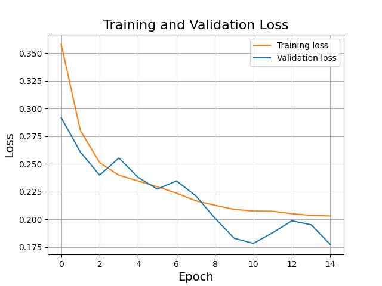
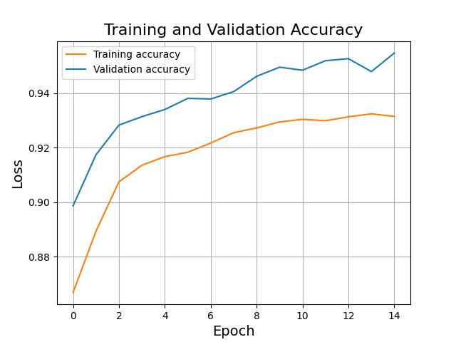

# graph-neural-networks

A project exploring the representation of graphs, and using them to train Graph Neural Networks for whole-graph classification.

# Setup

`python_version < 3.10`

After cloning this repostiory, you can install the requirements by running `pip install -r requirements.txt` (assuming you have Python installed) and run the following scripts:

- `dataset_generator.py` to randomly generate a dataset of undirected graphs labeled as having a Eulerian path or not.  
- `model_training.py` to train a graph neural network on the generated dataset.  
- `model_inference.py` to test a trained model on more randomly graphs.  

# Approach

Approximately 400,000 undirected graphs were generated randomly and split into train/validation/test sets using an 60/20/20 split. Each graph was generated by following a uniform distribution on the interval `[1, 50]` for the number of vertices `V` and a Gaussian distribution with `mean=3*V` and `std=V` for the number of edges `E`. The edges were then picked by pulling two random vertices `E` times *with replacement*, but counting duplicate edges as a single.

Each graph was automatically classified as having or not having a Eulerian circuit (a graph is said to have a Eulerian circuit if and only if it has 0 or 2 odd degrees). This feature was later used as the target label for prediction.

A graph neural network was then trained on this dataset for 15 epochs, reaching a validation accuracy of ~95%:

 

# Issues

While evaluating the model, it becomes clear that there is a bias towards classifying graphs with a small number of vertices as Eulerian and vice-versa. This is most likely due to the fact that randomly generated graphs tend to be less likely to have Eulerian paths as the number of vertices increases. The issue could potentially be solved by modifying the dataset generator to favor Eulerian graphs with a higher number of vertices.
